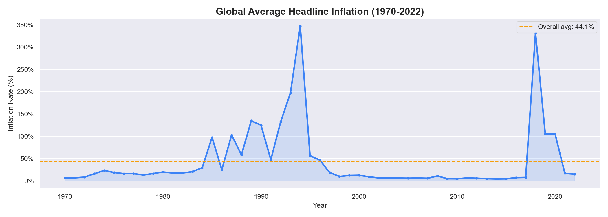
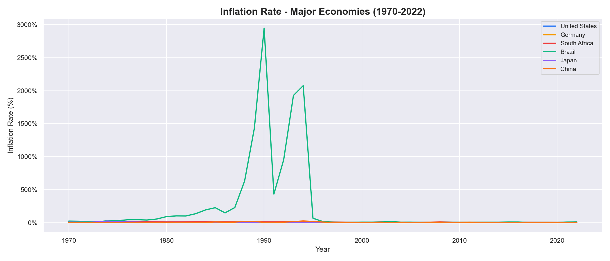
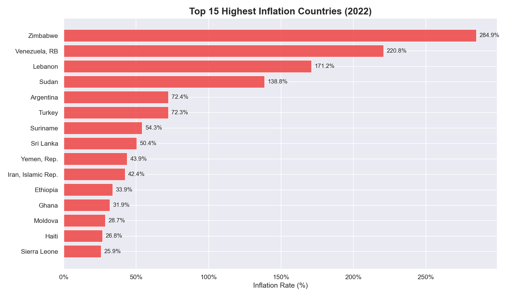
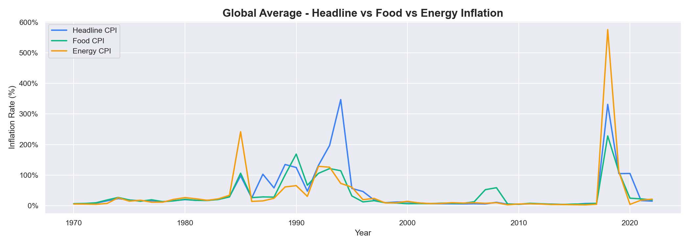
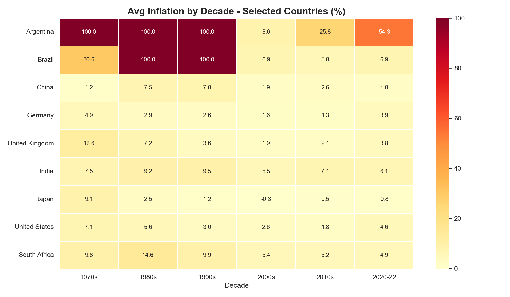

# 🌍 EconoScope — Global Inflation & Economic Analysis

An exploratory data analysis of global inflation trends across 212 countries from 1970 to 2022. The project covers headline CPI trends, country comparisons, inflation type breakdowns and decade-by-decade heatmaps.

---

## 📋 Table of Contents

- 🎯 Project Overview
- 📊 Key Questions Answered
- 📈 Visualizations
- 🛠️ Technologies Used
- 📁 Project Structure
- 🚀 How to Run
- 💡 Key Findings
- 👨‍💻 Author

---

## 🎯 Project Overview

This project analyses the **Global Inflation Dataset** sourced from the IMF and World Bank, covering 212 countries across five decades. The dataset includes five inflation types: Headline CPI, Food CPI, Energy CPI, Core CPI and Producer Price Inflation.

The analysis focuses on:
- Long-term global inflation trends
- Country-level comparisons across major economies
- Identifying the highest-inflation countries in recent years
- Comparing headline, food and energy inflation
- Decade-by-decade heatmap for selected countries

---

## 📊 Key Questions Answered

- How has global average inflation changed since 1970?
- Which countries had the highest inflation in 2022?
- How do major economies like the US, Germany, Turkey and Brazil compare?
- Is food or energy inflation higher than headline CPI?
- Which decades were the most inflationary?

---

## 📈 Visualizations

### Global Average Inflation Trend (1970-2022)


### Inflation Rate - Major Economies


### Top 15 Highest Inflation Countries (2022)


### Headline vs Food vs Energy Inflation


### Inflation Heatmap by Decade


---

## 🛠️ Technologies Used

- **Language:** Python 3.12
- **Data Manipulation:** Pandas, NumPy
- **Visualization:** Matplotlib, Seaborn
- **Environment:** Jupyter Notebook

---

## 📁 Project Structure

```
EconoScope/
├── analysis.ipynb          ← Main analysis notebook
├── requirements.txt
├── LICENSE
├── README.md
├── data/
│   └── Global Dataset of Inflation.csv   ← Not tracked by git
└── outputs/
    ├── global_inflation_trend.png
    ├── country_comparison.png
    ├── top_inflation_countries.png
    ├── inflation_types.png
    └── inflation_heatmap.png
```

---

## 🚀 How to Run

**1. Install dependencies:**
```bash
pip install -r requirements.txt
```

**2. Download the dataset:**

Get the CSV from [Kaggle](https://www.kaggle.com/datasets/belayethossainds/global-inflation-dataset-212-country-19702022) and place it inside the `data/` folder.

**3. Run the notebook:**
```bash
jupyter notebook analysis.ipynb
```

Run all cells top to bottom. Charts will be saved automatically to `outputs/`.

---

## 💡 Key Findings

- Global average inflation peaked in the **1970s and 1980s**, driven by oil crises
- **Turkey** shows consistently high and rising inflation across all decades
- **Japan** maintained near-zero inflation for decades, a unique economic phenomenon
- Food and energy inflation tend to spike higher than headline CPI during crises
- The **2020-2022** period saw a sharp global inflation rise post-COVID across all economies

---

## 👨‍💻 Author

**Berke Arda Turk**  
Data Science & AI Enthusiast | Computer Science (B.ASc)  
[🌐 Portfolio](https://berkeardaturk.com) · [💼 LinkedIn](https://www.linkedin.com/in/berke-arda-turk/) · [🐙 GitHub](https://github.com/Mood07)
